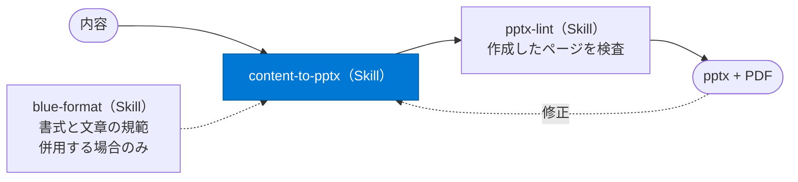
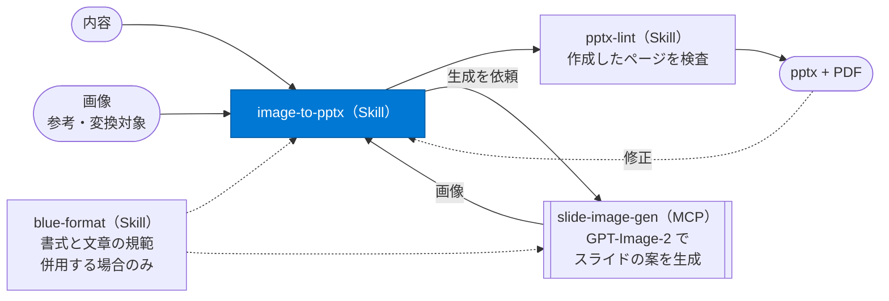

# pptx-as-code

コーディングエージェントで PowerPoint 資料を作成するためのプラグイン。GitHub Copilot と Claude Code に対応する。

内容を渡すとスライドをコードで組み立て、PowerPoint ファイルと PDF を出力する。中身は画像ではなくテキスト・図形・表で構成されるため、PowerPoint でそのまま編集できる。作成・確認・修正は VS Code 上で完結する。

## 📦 含まれるもの

| 種類 | 名前 | 役割 | 使用する場面 |
|---|---|---|---|
| Skill | `content-to-pptx` | 内容からスライドをコードで直接組み立てる | 表・箇条書き・文章が中心の資料 |
| Skill | `image-to-pptx` | スライドを画像で設計し、編集できる pptx へ再構成する | 図が中心の資料、レイアウトの自由度が必要な場合 |
| Skill | `blue-format` | 青基調の所定フォーマットと、文章・構成の規範を与える | **その書式で作成する場合のみ。** 別の書式やブランドでは使用しない |
| Skill | `pptx-lint` | 出力を 1 ページずつ検査し、崩れと規範違反をページ番号付きで返す | 作成の完了時と、構成を変更した場合 |
| Skill | `env-setup` | 実行に必要なものを点検して導入する | 初回と、動作しなくなった場合 |
| MCP | `slide-image-gen` | スライドの案を画像で生成する | `image-to-pptx` が呼び出す。単独でも使用できる |

すべて 1 つのプラグインに含まれる。導入も更新も 1 回で完了する。
画像生成 MCP には Azure サブスクリプションが必要だが、未設定でもスキルは動作する（画像を経由する方法のみ使用できない）。
構成の詳細は [docs/architecture.md](docs/architecture.md)。

## 🎨 作成方法

主に 2 通り。**出力形式は同じで、成果はどちらも作業フォルダの定義ファイル（コード）に残る。**

### 方法 1. 内容から直接作成する（content-to-pptx）



Markdown・テキスト・会話での指示を、そのままスライドの定義に変換する。表・箇条書き・文章が中心の資料に適する。画像生成は使用しない。

### 方法 2. 画像を経由して作成する（image-to-pptx）



**画像生成モデルの表現力を、資料の品質に反映させる方法。**

コードだけで図を組み立てると、あらかじめ用意された型の組み合わせに限られる。画像生成モデルは、伝えたい内容に応じてレイアウト・図の構造・要素の配置そのものを設計できる。完成形に近いスライドを先に画像で生成し、それを設計図として PowerPoint のテキスト・図形・表へ組み直す。**自由度の高いレイアウトを、編集できる形で得られる。**

画像の生成は `slide-image-gen` MCP が担い、`image-to-pptx` が内部で呼び出す。利用者が個別に指定する必要はない。渡すのは内容だけでよく、ページ数も問わない。

参考にしたい画像を併せて渡すと、その書式に寄せて作成する。指定された体裁や既存の資料に合わせる場合に使用する。

完成した画像を渡した場合は、生成を経ずそのまま変換する。スクリーンショットなど画像の形でしかない資料を、編集できる形に起こす用途。

pptx を伴わず画像だけが必要な場合は、チャットで「slide-image-gen で〇〇のスライド画像を作成」と指示する。構図を先に確認する場合に適する。

### ＜補足：作成後の修正＞

図の破線で示した戻りが、**修正の規模に応じてどこまで遡るか。** 文言を直すたびに画像を生成し直したり、全ページを検査したりはしない。

| 修正の内容 | 画像生成（方法 2） | `pptx-lint` |
|---|---|---|
| 文言、数値、色、強調、要素の位置、表や本文の追記 | 不要 | 不要（該当ページのみ確認） |
| スライドの追加・削除・並べ替え、見出し構成の変更 | 不要 | 実行 |
| 図のメタファーや構図そのものの変更 | 実行 | 実行 |

判断に迷う場合は、定義ファイルの修正から着手する。図の説得力が不足する場合にのみ画像生成へ戻す。

### ＜補足：書式と規範＞

`blue-format` は色とフォントに加えて、**スライドの構成と文章の書き方**を規範として定める。主なものは次のとおり。

- **1 スライド 1 論点。** 論点が 2 つ入ったらスライドを分ける
- **要素ごとに役割と文体を固定する。** タイトルは名詞の体言止め、キーメッセージはですます調の完全文、本文はである調
- **1 枚だけ配布されても分かる。** 章番号や他スライドへの参照を書かない
- **色に意味を持たせる。** 青の濃淡とグレーで構成し、赤は危険を示す場合だけに使う

規範や指定理由などは [docs/format.md](docs/format.md) を参照。

## 🚀 導入

> **サンドボックス環境での実行を推奨する。** エージェントがパッケージの導入とコマンドの実行を伴うため、既存の環境への影響を完全には制御できない。Dev コンテナを使用すると、作業を隔離した状態で実行できる。定義と手順は [devcontainer/](devcontainer/README.md) にある。

導入の前に次を確認する。

| 項目 | 内容 |
|---|---|
| 対応 OS | Linux、WSL、macOS。Windows ネイティブは LibreOffice の導入で動作する見込みだが、実機での検証は未実施 |
| Azure サブスクリプション | 画像を経由して作成する場合に必要。Microsoft Foundry の GPT-Image-2 を使用し、生成した画像の枚数に応じて課金される |

### 1. エージェントを導入する

使用するツールに応じて、どちらかを導入する。両方で使用する場合は両方を導入する。
導入手順はそれぞれの公式ドキュメントにあり、前提条件と OS 別の導入方法が分かる。

- [GitHub Copilot CLI のインストール](https://docs.github.com/en/copilot/how-tos/set-up/install-copilot-cli)
- [Claude Code のセットアップ](https://code.claude.com/docs/en/setup)

### 2. プラグインを導入する

GitHub Copilot CLI の場合。VS Code の GitHub Copilot Chat でも使用できるようになる。

```bash
copilot plugin marketplace add akitamoto-dev/pptx-as-code
copilot plugin install pptx-as-code@pptx-as-code
```

Claude Code の場合。

```bash
claude plugin marketplace add akitamoto-dev/pptx-as-code
claude plugin install pptx-as-code@pptx-as-code
```

導入したスキルはすべてのプロジェクトで有効になる。

### 3. 環境を構築する

エージェントを起動し（`copilot` または `claude`）、環境構築のスキルを実行する。

```
/pptx-as-code:env-setup
```

必要なものの導入、見本のビルド、画像生成 MCP の設定までを実施する。**コマンドの手動実行や環境変数の設定は不要。** 導入の前に承諾を求め、導入できなかったものがあればその内容を報告する。

画像生成 MCP を設定すると Azure にリソースが作成される。使用しなくなった場合はリソースグループを削除する。

### 4. 動作確認

1 ページの資料を作成して確認する。

内容から直接作成する方法。

```
/pptx-as-code:blue-format /pptx-as-code:content-to-pptx LLM とは を説明する 1 ページの資料を作成してください。
```

画像を経由して作成する方法（画像生成 MCP の設定が必要）。

```
/pptx-as-code:blue-format /pptx-as-code:image-to-pptx AIエージェント とは を説明する 1 ページの資料を作成してください。
```

出力された pptx を PowerPoint で開き、崩れがなければ完了。

**MCP のツールはスラッシュコマンドの候補に表示されない。** ツールはエージェントが呼び出すもので、利用者が `/` から起動する対象ではないため。質問文にも記載せず、`image-to-pptx` を呼び出せばその中で使用される。
画像生成のみを直接呼び出す場合は、チャットで「slide-image-gen で画像を作成」と指示する。Claude Code ではスラッシュコマンド `/mcp__slide-image-gen__generate` も使用できる。
MCP の認識状況は、セッション内で `/mcp` を実行すると確認できる（Claude Code では起動前に `claude mcp list` でも確認できる）。

## 🔄 更新

カタログ（marketplace）とプラグインの順に取り込む。カタログは提供中のバージョンの索引で、プラグイン本体とは別に管理される。

GitHub Copilot。

```bash
copilot plugin marketplace update pptx-as-code
copilot plugin update --all
```

Claude Code。

```bash
claude plugin marketplace update pptx-as-code
claude plugin update pptx-as-code@pptx-as-code
```

**更新後はクライアントを再起動する。** プラグインと MCP の定義は起動時にのみ読み込まれる。VS Code の GitHub Copilot Chat では「Developer: Reload Window」を実行し、画像生成 MCP を更新した場合はツール選択で `slide-image-gen` の「更新ツール」を押す。

導入先のファイルは一式が差し替わる。作成済みの作業フォルダは、雛形を複製したものとして独立して扱うため更新されない。
`env-setup` の再実行は通常不要で、必要な道具が増えた場合や、動作しなくなった場合に実行する。

## 📖 参考

| 参照先 | 内容 |
|---|---|
| [devcontainer/README.md](devcontainer/README.md) | Dev コンテナ（サンドボックス環境）の構築 |
| [docs/format.md](docs/format.md) | 書式と規範の内容、そう定めている理由 |
| [docs/architecture.md](docs/architecture.md) | 構成、技術スタック、ディレクトリ |
| [mcp-server/README.md](mcp-server/README.md) | 画像生成 MCP の設定と運用 |
| [docs/development.md](docs/development.md) | プラグイン自体の改修 |
| [THIRD-PARTY-NOTICES.md](THIRD-PARTY-NOTICES.md) | 同梱物の権利表示 |
| [LICENSE](LICENSE) | 本体のライセンス（MIT） |
